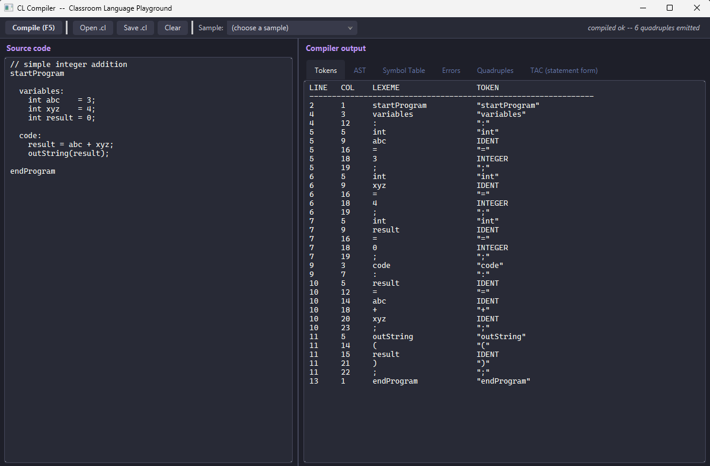
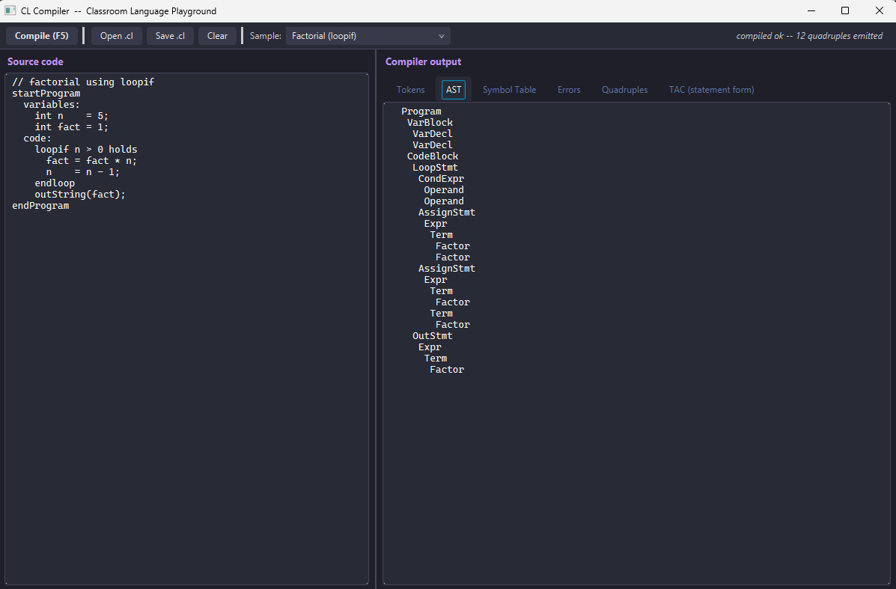
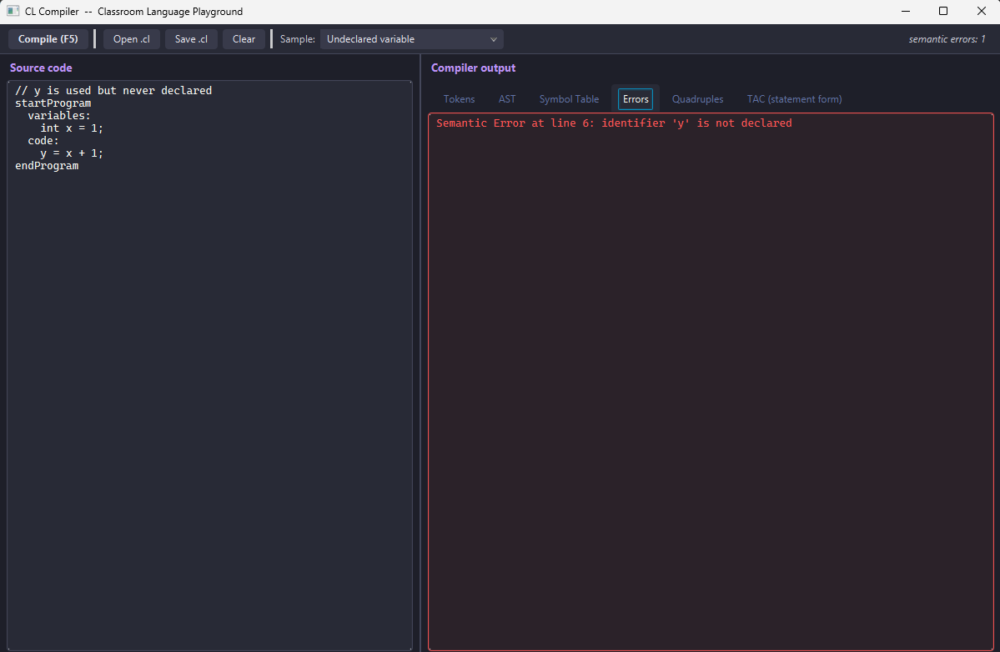
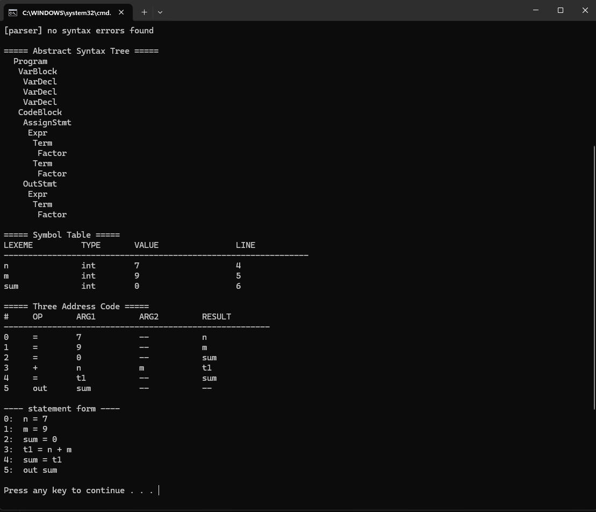
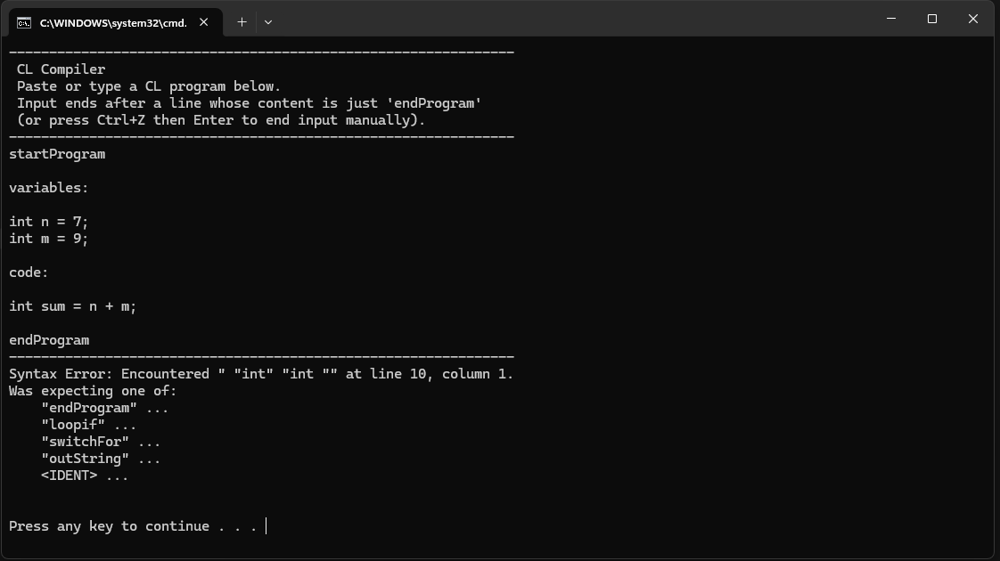

# CL Compiler &nbsp; <sub><sup>JavaCC · JJTree · JavaFX</sup></sub>

A from-scratch compiler front end and three-address-code generator for the
Classroom Language (CL), shipped with a JavaFX playground that lets you watch
the source flow through every phase live -- tokens, AST, symbol table,
semantic errors and quadruples -- as you type.

Built for the CSC323 Compiler Construction course at Bahria University
Islamabad, Spring 2026, and then dressed up as a proper desktop app.

> Authors&nbsp;·&nbsp; **Sameer Hassan** (01-134232-168) &nbsp;·&nbsp; **Haroon Mazhar** (01-134232-121) &nbsp;·&nbsp; BSCS 6-C &nbsp;·&nbsp; Sir Abdul Raheem Aleem

---

## What it does

CL is a small imperative language with `int`, `float`, `string` and `char`
data types, assignment, `outString`, a conditional loop (`loopif`) and a
multi-way branch (`switchFor`). The compiler:

| Phase | Implementation | Output you can see in the GUI |
| --- | --- | --- |
| **Lexical** | JavaCC token rules in [CL.jjt](src/main/jjtree/CL.jjt) | Tokens tab (line / col / lexeme / kind) |
| **Syntax**  | Top-down LL(1) parser generated by JavaCC + JJTree | AST tab (indented tree) |
| **Symbol table** | Hand-written [SymbolTable.java](src/main/java/cl/SymbolTable.java) | Symbol Table tab |
| **Semantic** | Hand-written [SemanticAnalyzer.java](src/main/java/cl/SemanticAnalyzer.java) | Errors tab (line-numbered) |
| **Intermediate code** | Hand-written [IntermediateCodeGenerator.java](src/main/java/cl/IntermediateCodeGenerator.java) | Quadruples tab + TAC tab |

The IR is the textbook **three-address-code in quadruple form**
`(op, arg1, arg2, result)` stored in an `ArrayList<Quad>`. Loops and
switches lower to labels + conditional jumps in the style of the Dragon Book.

---

## Screenshots

### JavaFX playground

The Tokens tab, showing the lexer output for the addition sample (line, column, lexeme, token kind for every token the scanner emitted):



The AST tab on the factorial program (12 quadruples emitted, indented tree of `LoopStmt`, `CondExpr`, `AssignStmt`, `Expr`, `Term`, `Factor`...):



The Errors tab when the semantic phase rejects a program (here, `y` is used in the code block but never declared):



### CLI mode

The same compiler core also runs as a classic stdin tool via `run-cli.bat`:





---

## Quick start

You need a JDK 17 or newer and (optionally) [Apache Maven](https://maven.apache.org).
The included `build.bat` will fall back to a bundled Maven install at
`C:\Users\samee\apache-maven-3.9.9` if `mvn` is not on the PATH.

```bat
build.bat        :: generates parser, compiles, builds the fat jar
run.bat          :: launches the JavaFX playground
run-cli.bat      :: stdin-only mode (paste a CL program, end with 'endProgram')
```

Or directly with Maven:

```bash
mvn package           # build target/cl-compiler-1.0.0.jar
mvn javafx:run        # launch GUI
java -jar target/cl-compiler-1.0.0.jar    # also launches GUI
```

---

## Project layout

```
src/main/jjtree/CL.jjt                       grammar (input to javacc)
src/main/java/cl/
    CLCompiler.java                          orchestrates every phase
    CompileResult.java                       structured result data class
    SymbolTable.java                         hand-written data structure
    SemanticAnalyzer.java                    hand-written checks
    IntermediateCodeGenerator.java           hand-written TAC emitter
    ASTPrinter.java                          tree -> indented string
src/main/java/clgui/
    App.java          MainController.java    JavaFX entry + controller
    Launcher.java                            shim for fat-jar main class
    TokenLister.java  Samples.java           lexer view + sample programs
src/main/resources/clgui/
    main.fxml         styles.css             UI layout + dark theme
report/report.tex     report/report.pdf      academic project report
PIPELINE.md                                  build + runtime pipeline diagram
.github/workflows/ci.yml                     GitHub Actions build
```

See [PIPELINE.md](PIPELINE.md) for the full build and runtime diagrams.

---

## CL by example

A factorial program. Paste it into the playground (or pipe it to
`run-cli.bat`):

```
startProgram
  variables:
    int n    = 5;
    int fact = 1;
  code:
    loopif n > 0 holds
      fact = fact * n;
      n    = n - 1;
    endloop
    outString(fact);
endProgram
```

A program the semantic analyser rejects (`a = b + c` where `b` is a string
and `c` is an integer):

```
startProgram
  variables:
    string b = "hi";
    int    c = 5;
    string a = "";
  code:
    a = b + c;
endProgram
```

```
Semantic Error at line 7: type mismatch in expression: '+' between string and int
```

---

## Implementation notes worth reading

* **Grammar trick.** `Expr -> Term (+|-) Term*` and `Term -> Factor (*|/) Factor*`
  give `*` and `/` higher precedence than `+` and `-` *without* needing
  any explicit precedence table -- it falls out of how the parser nests
  productions. This is the same shape used in the Dragon Book.
* **No nested control flow.** The CL spec forbids `loopif` or `switchFor`
  inside another `loopif` / `switchFor`. We enforce this at the grammar
  level: the body of `loopif` only accepts `AssignStmt | OutStmt`, so
  illegal nesting is rejected by the parser, not by the semantic phase.
* **Two error-collection styles.** Lexical and syntax errors short-circuit
  immediately (they tend to cascade). Semantic errors are accumulated
  into a list so the user sees every problem in one go.
* **JavaFX `Launcher` trick.** When JavaFX is bundled inside a shaded fat
  jar, the JVM refuses to run a class that extends `Application` as the
  `Main-Class`. A trivial [`Launcher`](src/main/java/clgui/Launcher.java)
  that forwards to `App.main` sidesteps it.

---

## License

[MIT](LICENSE)
